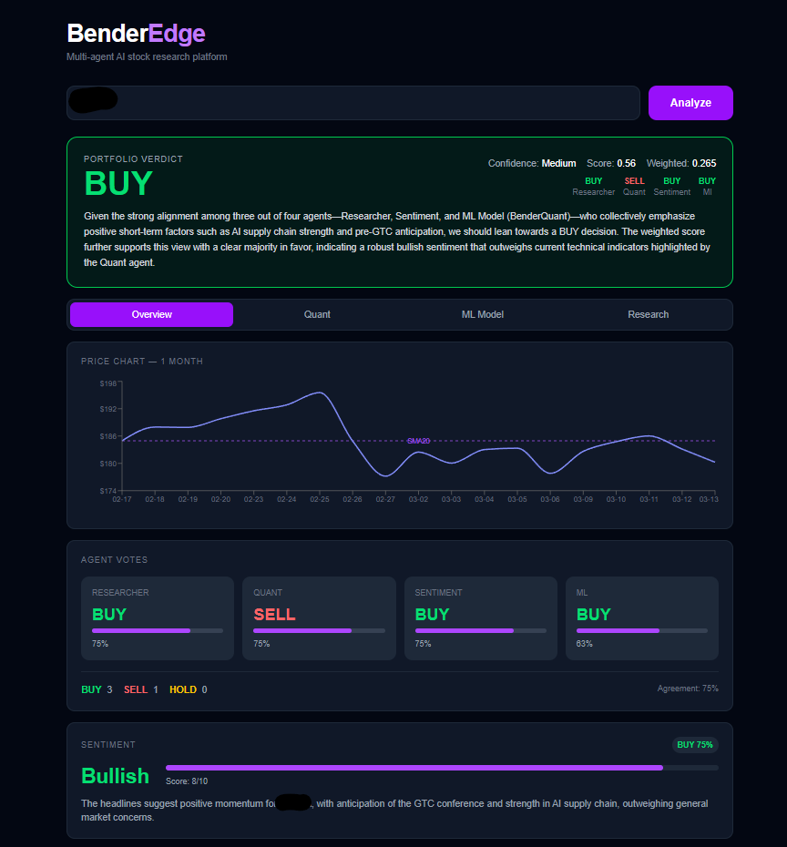

# 🧠 BenderEdge

> Multi-agent AI platform for stock research  
> Combining **quant analysis, ML signals, news intelligence and sentiment** into a unified trading verdict.



[](https://python.org)
[](https://nextjs.org)
[](https://xgboost.ai)
[](https://langchain.com)
[](https://ollama.com)
[](https://sqlite.org)
[](LICENSE)
---

## ⚠️ Disclaimer

**BenderEdge is a portfolio and research project. It is NOT financial advice.**

- All analysis is generated by AI models and automated systems
- Results may be inaccurate, outdated, or misleading
- Never make investment decisions based solely on this tool
- Past backtest performance does not guarantee future results
- The creator assumes no responsibility for any financial losses

**Use at your own risk.**

---

## Overview

**BenderEdge** is a multi-agent AI system that analyzes stocks using 5 specialized agents working in parallel. Each agent produces a **BUY / SELL / HOLD vote with confidence score**. A portfolio agent aggregates all signals using **weighted voting** to produce the final verdict.

### Why BenderEdge?

Most stock analysis tools give you a single signal from a single model. BenderEdge is different:

- **5 agents with different methodologies** vote independently
- **Disagreement is a signal** — low agreement = lower confidence
- **ML model trains on-the-fly** for each ticker, no stale pre-trained weights
- **Sector-aware XGBoost** — different hyperparameters per sector
- **Multi-horizon signals** — 1-7 day, 1-3 month, 3+ month predictions
- **SHAP explainability** — understand what drove each decision
- **BenderScanner** — scan entire indices for opportunities
- **Accuracy tracking** — validate predictions against real price movements
- **Fully local** — Ollama LLM, no API costs, no data sent to third parties
- **Real-time streaming** — watch each agent work as it happens

---

## Architecture
```
User Input (Ticker / Index)
         │
         ▼
FastAPI Orchestrator (LangChain)
         │
         ├─── Researcher Agent  ──► NewsAPI + LLM analysis
         ├─── Quant Agent       ──► RSI, MACD, BB, SMA, ATR risk mgmt
         ├─── Sentiment Agent   ──► Headline tone scoring
         ├─── BenderQuant Agent ──► XGBoost on-the-fly + SHAP
         ├─── Insider Agent     ──► SEC EDGAR Form 4
         ├─── Macro Agent       ──► FRED API — rates, inflation, GDP
         ├─── Earnings Agent    ──► EPS history + surprise
         │
         ▼
Portfolio Agent (Weighted Voting)
         │
         ▼
  BUY / SELL / HOLD + Confidence Score
         │
         ├──► SSE Streaming → Next.js Dashboard
         └──► SQLite → History + Accuracy Tracking
```

---

## Agents

### 🔍 Researcher Agent
Fetches live financial news via NewsAPI. Identifies the most market-moving headlines, extracts risk signals and catalysts, and votes with confidence.

**Output:** Summary · Spotlight headline · Risk · Catalyst · Vote

### 📊 Quant Agent
Computes 11 technical indicators from price history using yfinance.

| Indicator | Signal |
|-----------|--------|
| RSI (14) | Oversold / Overbought |
| MACD | Bullish / Bearish crossover |
| Bollinger Bands | Price position relative to bands |
| SMA 20 / 50 | Trend direction |
| Support / Resistance | Key price levels |
| Volume spike | Unusual activity |

### 💬 Sentiment Agent
Analyzes news headline tone and produces a numerical sentiment score with directional label.

**Output:** Score (-10 → +10) · Bullish / Neutral / Bearish · Vote

### 🤖 BenderQuant ML Agent
The most sophisticated agent. Powered by **XGBoost**, trained on-the-fly using 2 years of OHLCV data for the requested ticker.

**Multi-horizon signals:**
- 1-7 day short-term prediction
- 1-3 month mid-term prediction
- 3+ month long-term prediction

**Sector-aware training:**
Each sector uses optimized XGBoost hyperparameters — Technology, Financial, Energy, Healthcare, and 7 more sectors each have tuned parameters for better accuracy.

**SHAP Explainability:**
Every decision comes with feature importance — see exactly which indicator drove the model's verdict.

**Model quality metrics:**
- 5-fold cross-validation score
- Test set accuracy

**Backtest (2 years):**
- Total return · Sharpe ratio · Max drawdown · CAGR
- Equity curve · Recent trade log

**Fundamentals:**
- P/E ratio · EPS · Market Cap · Beta
- 52-week high/low · Sector · AI company detection

> Powered by [BenderQuant](https://github.com/yusufbender/benderquant) — a standalone XGBoost financial classification project.

### 🏦 Portfolio Agent
Aggregates all agent votes using a weighted system designed to prioritize quantitative signals.

| Agent | Weight | Rationale |
|-------|--------|-----------|
| Quant | 30% | Objective, rule-based |
| BenderQuant ML | 25% | Data-driven, ticker-specific |
| Sentiment | 15% | News-driven momentum |
| Researcher | 10% | Contextual intelligence |
| Earnings | 10% | Fundamental performance |
| Macro | 5% | Economic environment |
| Insider | 5% | Smart money signals |
```
confidence_score = agent_agreement × signal_strength
```

---

## BenderScanner

Scan entire market indices automatically. BenderScanner runs all 5 agents on each ticker and ranks opportunities by signal strength.

**Supported indices:**
- S&P 500 (top 20)
- NASDAQ 100 (top 20)
- BIST 50
- BIST 100

**Accuracy Tracker:**
Every analysis is saved to SQLite. After 7 days, the system automatically validates predictions against real price movements and calculates:
- Overall accuracy %
- Accuracy by verdict (BUY / SELL / HOLD)
- Average return per signal type

---

## Example Output

**Ticker: TSLA**
```
━━━━━━━━━━━━━━━━━━━━━━━━━━━━━━━━━━━━
 PORTFOLIO VERDICT:  SELL
 Confidence:         High (0.79)
 Weighted Score:     -0.862
━━━━━━━━━━━━━━━━━━━━━━━━━━━━━━━━━━━━

 Agent Votes:
  Researcher  →  HOLD  (75%)   mixed signals
  Quant       →  SELL  (75%)   bearish MACD, below SMA
  Sentiment   →  SELL  (75%)   UK sales drop -45%
  ML          →  SELL  (97%)   0/5 BUY signals last 5 days

 Agreement: 75%  |  BUY: 0  SELL: 3  HOLD: 1

 Multi-horizon:
  1-7 day  →  SELL 97%
  1-3 month → SELL 83%
  3+ month →  SELL 99%

 SHAP Top Features:
  RSI            +1.28  (BUY pressure)
  Volatility     -0.48  (SELL pressure)
  MACD           +0.37  (BUY pressure)

 BenderQuant Backtest (2Y):
  Return: +340%  |  Sharpe: 2.1  |  Max DD: -9.2%
━━━━━━━━━━━━━━━━━━━━━━━━━━━━━━━━━━━━
```

---

## Tech Stack

| Layer | Technology | Purpose |
|-------|-----------|---------|
| Frontend | Next.js 14 + Tailwind + Recharts | Dashboard UI |
| Backend | FastAPI + Python | API + orchestration |
| ML | XGBoost + scikit-learn + SHAP | On-the-fly model training |
| LLM | Ollama (Qwen2.5:7b) + LangChain | Agent reasoning |
| Data | yfinance + NewsAPI | Price + news data |
| Streaming | Server-Sent Events (SSE) | Real-time agent output |
| Database | SQLite | Analysis history + validation |

---

## Features

- ✅ **Real-time agent streaming** — each agent result appears as it completes
- ✅ **Tab-based dashboard** — Overview / Quant / ML Model / Research
- ✅ **Weighted multi-agent voting** with quantified confidence scoring
- ✅ **On-the-fly XGBoost training** — no stale pre-trained weights
- ✅ **Sector-aware hyperparameters** — 11 sectors with optimized params
- ✅ **Multi-horizon ML signals** — 1-7 day / 1-3 month / 3+ month
- ✅ **SHAP feature importance** — explainable AI decisions
- ✅ **Full backtesting** — Sharpe, Max Drawdown, CAGR, equity curve
- ✅ **Fundamental analysis** — P/E, EPS, Market Cap, Beta
- ✅ **BenderScanner** — scan S&P500, NASDAQ100, BIST50, BIST100
- ✅ **Accuracy tracking** — validate predictions vs real price movements
- ✅ **Analysis history** — SQLite persistence across sessions
- ✅ **Global market support** — NYSE, NASDAQ, BIST, LSE, Frankfurt, Tokyo
- ✅ **Spotlight headlines** with Risk / Catalyst extraction
- ✅ **Fully local LLM** — no API costs, no data leakage
- ✅ **7 specialized agents** — Quant, ML, Sentiment, Insider, Macro, Earnings, Research
- ✅ **ATR-based risk management** — stop loss, take profit, position sizing
- ✅ **Walk-forward backtesting** — out-of-sample validation
- ✅ **SMOTE class balancing** — handles imbalanced training data
- ✅ **Sidebar dashboard** — clean navigation between analysis sections
- ✅ **Landing page** — quick-start with recent tickers

---

## Run Locally

### Prerequisites
- Python 3.10+
- Node.js 18+
- [Ollama](https://ollama.com) with `qwen2.5:7b`
- [NewsAPI](https://newsapi.org) free key
```bash
# 1. Clone
git clone https://github.com/yusufbender/BenderEdge.git
cd BenderEdge

# 2. Backend setup
python -m venv venv
venv\Scripts\activate          # Windows
source venv/bin/activate       # macOS/Linux
pip install -r requirements.txt

# 3. Environment
echo "NEWS_API_KEY=your_key_here" > backend/.env

# 4. Pull local LLM
ollama pull qwen2.5:7b

# 5. Start backend
cd backend
uvicorn main:app --reload

# 6. Start frontend (new terminal)
cd ../frontend
npm install
npm run dev
```

Open [http://localhost:3000](http://localhost:3000)  
Scanner: [http://localhost:3000/scanner](http://localhost:3000/scanner)

---

## Supported Markets

| Market | Suffix | Example |
|--------|--------|---------|
| NYSE / NASDAQ | — | `AAPL` `TSLA` `NVDA` |
| Borsa Istanbul | `.IS` | `THYAO.IS` `GARAN.IS` |
| London | `.L` | `HSBA.L` |
| Frankfurt | `.DE` | `SAP.DE` |
| Tokyo | `.T` | `7203.T` |
| Hong Kong | `.HK` | `0700.HK` |

---

## Roadmap

### ✅ v1.0 — Core System
- [x] 5-agent voting architecture
- [x] FastAPI + SSE streaming backend
- [x] Next.js tab-based dashboard
- [x] BenderQuant XGBoost integration
- [x] On-the-fly model training
- [x] Backtest + equity curve
- [x] Fundamental data
- [x] Global market support

### ✅ v1.1 — Multi-horizon Signals
- [x] 1-7 day short-term signal
- [x] 1-3 month mid-term signal
- [x] 3+ month long-term signal
- [x] Per-horizon XGBoost models

### ✅ v1.2 — Sector Intelligence
- [x] Sector-based XGBoost hyperparameter optimization
- [x] 11 sector profiles (Technology, Financial, Energy...)
- [x] Automatic sector detection via yfinance

### ✅ v1.3 — Explainability
- [x] SHAP feature importance
- [x] Top 5 features driving each decision
- [x] Visual bar chart in ML Model tab

### ✅ v1.4 — BenderScanner
- [x] Multi-index scanner (SP500, NASDAQ100, BIST50, BIST100)
- [x] SQLite analysis history
- [x] 7-day prediction validation
- [x] Accuracy tracker by verdict type

### ✅ v1.5 — New Agents
- [x] Insider Trading Agent (SEC EDGAR Form 4)
- [x] Macro Agent (FRED API)
- [x] Earnings Agent (EPS beat/miss history)

### ✅ v1.6 — UI Redesign
- [x] Landing page with hero section
- [x] Sidebar navigation
- [x] Navbar with ticker + new analysis button

### ✅ v1.7 — Risk & Model Quality
- [x] ATR-based risk management
- [x] Walk-forward backtesting
- [x] SMOTE class balancing
- [x] Model determinism (random_state=42)
- [x] Rate limiting

### 🔮 v1.8 — MLOps
- [ ] Redis cache
- [ ] MLflow experiment tracking
- [ ] LangGraph agent orchestration

### 🚀 v2.0 — Production
- [ ] User authentication
- [ ] Alert system
- [ ] Deploy on Railway + Vercel
- [ ] Docker Compose setup

---

## Project Structure
```
BenderEdge/
├── backend/
│   ├── agents/
│   │   ├── researcher.py     # News + LLM analysis
│   │   ├── quant.py          # Technical indicators
│   │   ├── sentiment.py      # Headline tone scoring
│   │   ├── ml_agent.py       # XGBoost + SHAP + multi-horizon
│   │   └── portfolio.py      # Weighted voting
│   ├── routers/
│   │   ├── analysis.py       # SSE + REST endpoints
│   │   └── scanner.py        # Market scanner endpoints
│   ├── database.py           # SQLite — history + validation
│   ├── models/               # Saved model artifacts
│   └── main.py               # FastAPI app
└── frontend/
    └── app/
        ├── page.tsx           # Main dashboard
        └── scanner/
            └── page.tsx       # BenderScanner
```

---

## Related Projects

**[BenderQuant](https://github.com/yusufbender/benderquant)**  
XGBoost financial classification model. Trained on multi-ticker datasets with feature engineering, SMOTE oversampling, and GridSearch hyperparameter tuning. Powers the ML agent in BenderEdge.

---

## Author

**Yusuf** — AI / ML Engineer  
Building production-grade AI systems, LLM architectures, and intelligent financial tools.

---

⭐ *If you find this project useful or interesting, consider giving it a star.*

---

*This project is for educational and portfolio purposes only. Not financial advice.*
